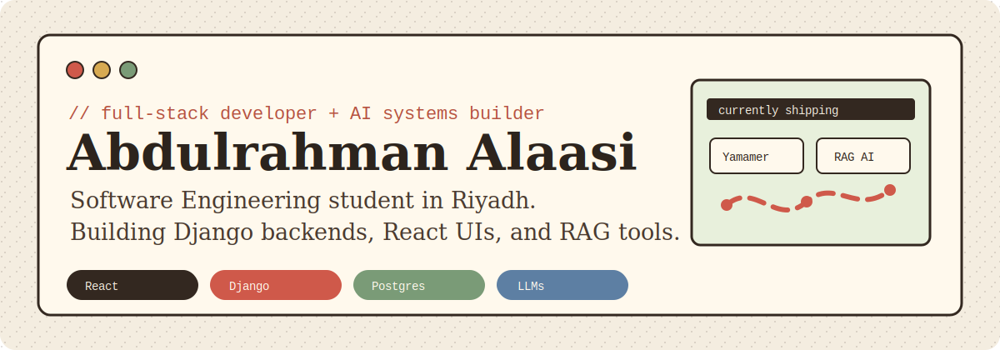
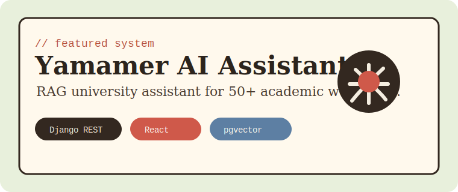
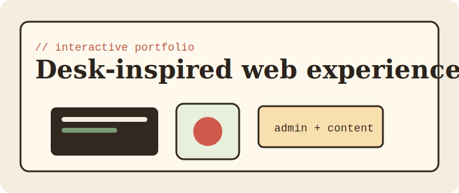
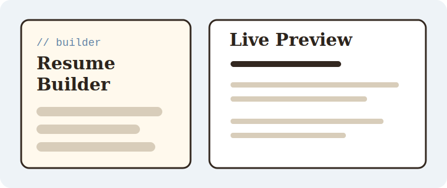
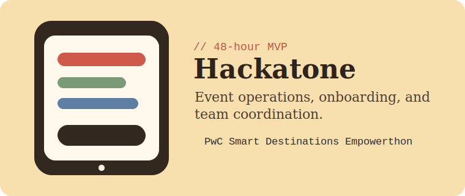

<p align="center">
  <a href="https://abdulrahman.alaasi.dev">
    
  </a>
</p>

<p align="center">
  <a href="mailto:abdulrahmanalaasi24@gmail.com"></a>
  <a href="https://abdulrahman.alaasi.dev"></a>
  <a href="https://www.linkedin.com/in/Abdulrahman-alaasi"></a>
</p>

## Hi, I'm Abdulrahman

I'm a Software Engineering student at **Al Yamamah University** in Riyadh, graduating in **January 2027** with a **3.99 / 4.00 GPA**. I build full-stack products with a backend-first mindset, clean interfaces, and practical AI systems.

My current focus is **RAG-based assistants**, **Django REST backends**, **React interfaces**, and product experiences that feel calm, useful, and intentional.

```txt
based in      Riyadh, Saudi Arabia
building      AI university assistants, portfolio systems, developer tools
stack         Python, Django, React, TypeScript, PostgreSQL, Supabase
interests     system design, RAG, UI/UX, product engineering
```

## Featured Work

<table>
  <tr>
    <td width="50%">
      <a href="https://yamamer.com">
        
      </a>
      <h3>Yamamer AI Assistant</h3>
      <p>Lead engineer and system architect for a RAG-based university assistant covering 50+ academic workflows with a 300+ article pgvector knowledge base.</p>
      <p><b>Stack:</b> Django REST Framework, React, Supabase, PostgreSQL, pgvector, Gemini embeddings, Claude Haiku.</p>
      <p><a href="https://yamamer.com">Live site</a> · private production repository</p>
    </td>
    <td width="50%">
      <a href="https://abdulrahman.alaasi.dev">
        
      </a>
      <h3>Interactive Portfolio</h3>
      <p>A custom portfolio with a top-down SVG desk interface, animated project previews, responsive layouts, and a live admin system for managing content.</p>
      <p><b>Stack:</b> React, JavaScript, custom SVG interaction design, responsive frontend systems.</p>
      <p><a href="https://abdulrahman.alaasi.dev">Live site</a> · private portfolio repository</p>
    </td>
  </tr>
  <tr>
    <td width="50%">
      <a href="https://abdulrahman.alaasi.dev">
        
      </a>
      <h3>Resume Builder</h3>
      <p>A production-ready resume builder with multi-section editing and a live preview panel, built from scratch with modern frontend tooling.</p>
      <p><b>Stack:</b> Next.js App Router, TypeScript, Tailwind CSS.</p>
      <p>Case study available through my portfolio and CV.</p>
    </td>
    <td width="50%">
      <a href="https://abdulrahman.alaasi.dev">
        
      </a>
      <h3>Hackatone</h3>
      <p>Mobile-first event operations platform for staff onboarding, real-time coordination, and communication, delivered as a 48-hour PwC Empowerthon MVP.</p>
      <p><b>Role:</b> Product and AI solution developer.</p>
      <p>Hackathon MVP summarized in my portfolio and CV.</p>
    </td>
  </tr>
</table>

## Toolbox

<details open>
  <summary><b>Core engineering stack</b></summary>
  <br />
  <p>
    
  </p>
</details>

<details>
  <summary><b>AI and backend systems</b></summary>
  <br />
  <ul>
    <li>LLM integration, RAG pipelines, embeddings, semantic search, pgvector, REST APIs.</li>
    <li>Backend architecture with Django REST Framework, PostgreSQL, Supabase, and API-first workflows.</li>
    <li>Prompting and coding workflows with Claude Code and AI-assisted development tools.</li>
  </ul>
</details>

<details>
  <summary><b>Education, honors, and programs</b></summary>
  <br />
  <ul>
    <li>B.Sc. Software Engineering, Al Yamamah University. GPA 3.99 / 4.00. Graduating January 2027.</li>
    <li>First Class Honor and Dean's List for two consecutive years.</li>
    <li>McKinsey Forward Program participant, April 2026.</li>
    <li>PwC Middle East Smart Destinations Empowerthon participant, February 2026.</li>
  </ul>
</details>

## Public Labs

These are a few public repositories that show how I experiment with product tooling, performance workflows, UI systems, and applied software engineering:

<p>
  <a href="https://github.com/AbdulrahmanAlaasi/SARO"></a>
  <a href="https://github.com/AbdulrahmanAlaasi/K9"></a>
</p>
<p>
  <a href="https://github.com/AbdulrahmanAlaasi/contexy"></a>
  <a href="https://github.com/AbdulrahmanAlaasi/GanttFlow"></a>
</p>

## GitHub Signal

<p>
  
  
</p>

## Let's Build

I'm especially interested in full-stack product work, AI-assisted systems, developer tools, and interfaces that make complex workflows feel simple.

<p>
  <a href="mailto:abdulrahmanalaasi24@gmail.com">Email me</a> ·
  <a href="https://www.linkedin.com/in/Abdulrahman-alaasi">LinkedIn</a> ·
  <a href="https://abdulrahman.alaasi.dev">Portfolio</a>
</p>
