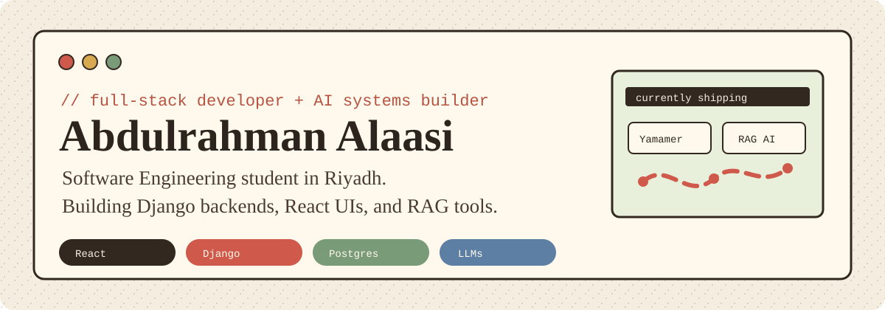
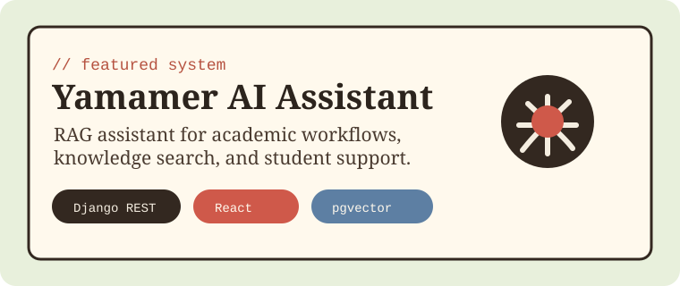
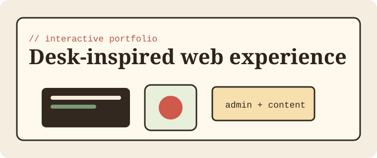

  

  
  
  

## Hi, I'm Abdulrahman

I'm a Software Engineering student at **Al Yamamah University** in Riyadh, graduating in **January 2027** with a **3.99 / 4.00 GPA**. I build full-stack products with a backend-first mindset, clean interfaces, and practical AI systems.

My current focus is **RAG-based assistants**, **Django REST backends**, **React interfaces**, and product experiences that feel calm, useful, and intentional.

- **Based in:** Riyadh, Saudi Arabia
- **Building:** AI university assistants, portfolio systems, and developer tools
- **Stack:** Python, Django, React, TypeScript, PostgreSQL, Supabase
- **Interests:** system design, RAG, UI/UX, and product engineering

## Featured Work

### Yamamer AI Assistant

Lead engineer and system architect for a RAG-based university assistant covering 50+ academic workflows with a 300+ article pgvector knowledge base.

**Stack:** Django REST Framework, React, Supabase, PostgreSQL, pgvector, Gemini embeddings, Claude Haiku.  
**Links:** [Live site](https://yamamer.com) / private production repository

---

## Toolbox

  
<b>Core engineering stack</b>

   
  

    
  

  
<b>AI and backend systems</b>

   
  <ul>
    <li>LLM integration, RAG pipelines, embeddings, semantic search, pgvector, REST APIs.</li>
    <li>Backend architecture with Django REST Framework, PostgreSQL, Supabase, and API-first workflows.</li>
    <li>Prompting and coding workflows with Claude Code and AI-assisted development tools.</li>
  </ul>

  
<b>Education, honors, and programs</b>

   
  <ul>
    <li>B.Sc. Software Engineering, Al Yamamah University. GPA 3.99 / 4.00. Graduating January 2027.</li>
    <li>First Class Honor and Dean's List for two consecutive years.</li>
    <li>McKinsey Forward Program participant, April 2026.</li>
    <li>PwC Middle East Smart Destinations Empowerthon participant, February 2026.</li>
  </ul>

## Let's Build

I'm especially interested in full-stack product work, AI-assisted systems, developer tools, and interfaces that make complex workflows feel simple.

  <a href="mailto:abdulrahmanalaasi24@gmail.com">Email me</a> /
  <a href="https://www.linkedin.com/in/Abdulrahman-alaasi">LinkedIn</a> /
  <a href="https://abdulrahman.alaasi.dev">Portfolio</a>

